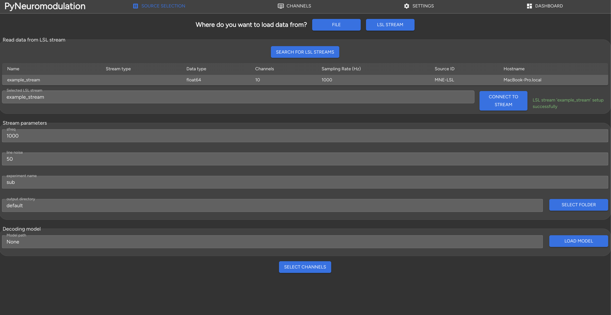
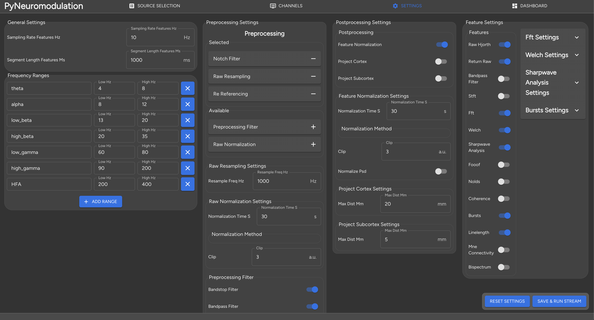
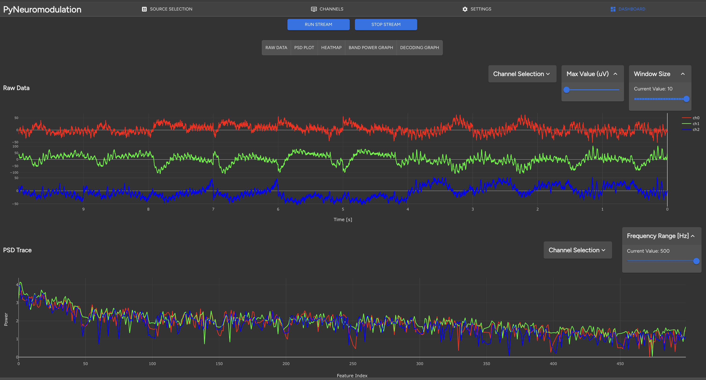
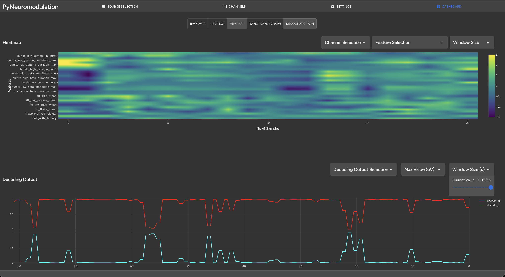

GUI
===

In this section we will explain the setup and use of the *py_neuromodulation* GUI.
First, the GUI dependencies can be installed with `uv`:

.. code-block:: bash

    uv pip install -e .[gui]

The GUI can be started by running the following command:

.. code-block:: bash

    run_gui

The ``run_gui`` command also starts a LabStreamingLayer stream from the `py_neuromodulation/data/` example directory.
The GUI is a react application, that can then be accessed via the browser at the following address:

.. code-block:: bash

    http://localhost:50001

The GUI is divided into three main sections:
  * **Source selection**: Data input which could be:
     * offline stored file, e.g. in `mne.io.read_raw <https://mne.tools/1.8/generated/mne.io.read_raw.html>`_ format or a simply `.txt` or `.npy` file
     * a `LabStreamingLayer <https://labstreaminglayer.org/#/>`_ stream
  * **channel selection**: Definition of re-referencing, usage, target selection for the list of available channels
  * **Feature selection**: Choosing the features for computation with the corresponding parameters

The source selection is shown in the following image:

.. image:: ../_static/sourceselection.png
   :alt: GUI
   :align: center

When clicking on the `SELECT FILE` button, a file dialog will open, where the user can select the file to be loaded:

.. image:: ../_static/fileselection.png
   :alt: GUI
   :align: center

Internally, available meta data such as sampling rate, line noise, available channel names will be read and a stream initialized.
Alternatively, the user can select a LabStreamingLayer stream by clicking on the upper `LSL STREAM` button. The available streams will be shown in a menu:

Clicking on the row of the desired stream will initialize then a stream with the read sampling rate, channel names and default settings.
A `.skops` decoding model, such as an openly-published `movement decoding model <https://zenodo.org/records/10794370>`_ can be loaded by clicking on the `LOAD MODEL` button.

Next, by selecting `SELECT CHANNELS`, the user is directed to the channel selection section:

.. image:: _static/channelselection.png
   :alt: GUI
   :align: center

Here the channel names, re-referencing, `mne supported types <https://mne.tools/stable/generated/mne.pick_types.html>`_ and target selection can be defined.
Next, by clicking on `SETTINGS`, the user is directed to the feature selection:

Here, many pre-processing, feature estimation and post-processing settings can be defined.
The main settings

  * `sampling rate features [Hz]`
  * `segment length features [ms]`

are defined the upper left section.
Additionally, frequency bands can be modified, added or deleted.
Once the settings are modified, they are internally validated for potential errors which would then be displayed:

.. image:: _static/pydantic.png
   :alt: GUI
   :align: center

Once the settings are correct, the user can click `SAVE & RUN STREAM` to jump to the stream control and feature visualization panel.
Here, different graphs can be selected by clicking on the corresponding graph list:

  * `Raw data`
  * `PSD plot`
  * `Heatmap`
  * `Band power graph`
  * `Decoding graph`

When clicking on `RUN STREAM`, the stream will start and the selected features will be computed in real-time.
In the terminal the feature computation is logged, and features and raw signals are displayed in the GUI:

Additionally, a heatmap with selected features can be displayed with the decoded model output:

.. raw:: html

    

In the :doc:`contributing </contributing>`  section we explain in further detail the GUI setup.

Known issues
~~~~~~~~~~~~

Currently the GUI dashboard for live feature visualization is not fully functional with too many selected channels and PSD features.
The websocket connection will then be broken off and no further features will be visualized, but the backend *nm.stream* will still be running, and raw data continued to be processed and saved. 
