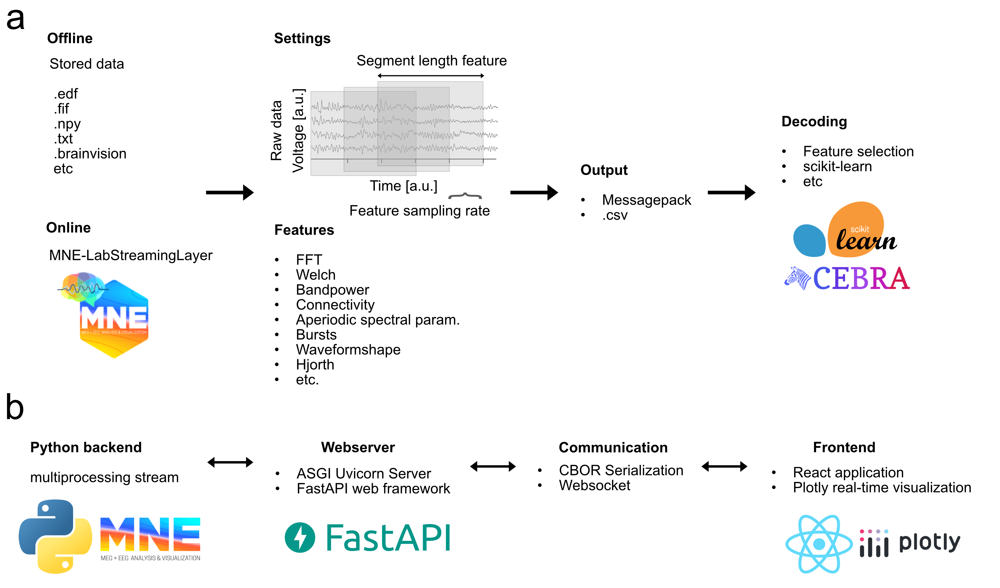

# Summary

Electrophysiological recordings can be obtained through various modalities, including electroencephalography (EEG), electrocorticography (ECoG), and invasive local field potentials (LFPs) recorded via deep brain stimulation (DBS). The analysis of these recordings often lacks standardization and clear documentation of the processing pipeline parameters used. Here, we introduce py_neuromodulation, a toolbox designed for standardized signal processing, feature extraction, and decoding of electrophysiological data. All parameters are explicitly defined in dedicated settings and channel parameterization files. The framework processes both real-time streamed and offline-stored recordings using the same pipeline, with only the data source being interchangeable. Additionally, a web-based graphical user interface (GUI) enables intuitive tool usage and visualization of the processing pipeline without requiring any code modifications. By introducing py_neuromodulation, we aim to simplify and standardize the analysis of electrophysiological recordings, facilitating reproducibility and accessibility in the field of neural data processing. py_neuromodulation also provides signal processing domain knowledge for many deep learning applications. We therefore intend to present machine learning and medical device engineers a tool that comprises established routines and parameters that are based on many previous electrophysiological analyses.

# Introduction

Recently, deep learning foundation models were presented that showed a performance leap on many clinical relevant downstream tasks [@yuan_brainwave_2024;@li_deep_2025]. The translation of neural signal processing to machine learning and medical device engineering, would further advance the fields of neural decoding and brain computer interfaces. We, therefore, developed a neural signal processing, feature estimation and decoding toolbox [py_neuromodulation](https://github.com/neuromodulation/py_neuromodulation), that includes several established and standardized pipelines that simplify processing of neural recordings.  
Analysis of electrophysiological recordings is commonly started by multiple preprocessing steps: resampling, notch-filtering, normalization, re-referencing (subtraction of neighboring channels), filtering (lowpass, highpass, bandpass), or artifact rejection [@cohen_analyzing_2014]. Next, the signals or features of interest are computed. Most commonly, signals are analyzed in the spectral domain. Here, different methods could be utilized, including Fast Fourier Transform, Welch transform, bandpass filtering, and others. In addition to spectral features, different feature modalities such as waveform-shape [@cole_brain_2017], periodic and aperiodic spectral parametrization [@donoghue_parameterizing_2020], bursting features [@tinkhauser_beta_2018], and others can be computed.
Many toolboxes exist already that enable analysis of electrophysiological recordings: in Matlab Fieldtrip [@oostenveld_fieldtrip_2011] or Brainstorm [@tadel_brainstorm_2011], and in Python mne-python [@gramfort_meg_2013]. These include extensive methods for various processing and feature computation.
By introducing *py_neuromodulation*, we want to address challenges in electrophysiological signal analysis.
First, the variety of different processing parameters poses a challenge first to select optimal methods best for machine learning neural decoding, and second hinders reproducibility, since often necessary parameters are not reported in scientific literature. Here we introduce parametrization files, *settings.yaml* and *channels.tsv*, that include all required steps for reproducibility. Additionally, it allows for a coupled pipeline of pre-processing, feature estimation and decoding. Thus, the performance contribution of various pre-processing steps can be assessed in combination with different feature estimation modalities and machine learning model architectures.  
Next, offline analysis often includes whole-recording normalization, non-causal filtering, or feature computation with test-set data leakage [@merk_machine_2022], which limits real-time compatibility. In py_neuromodulation, the data-source is represented as a Python generator, and can be interchangeable for online and offline processing.
Finally, electrophysiological research entails multiple technical and conceptual hurdles that pose substantial entry barriers for scientists without software development training. By providing an intuitive GUI for parametrization and raw-data and feature visualization, we aim to lower the research entry requirements in this domain.
We also want to emphasize that py_neuromodulation was already used in several scientific projects with different applications: ECoG and DBS-LFP movement strength regression [@merk_electrocorticography_2022;@cavallo_reinforcement_2025], movement intention classification [@kohler_dopamine_2024], seizure classification [@merk_invasive_2023], emotional valence decoding [@merk_invasive_2023], gait symptom estimation in rodents [@elgarulli_elgarullineurokin_2025], amongst others.

<!-- which wraps several functions around mne-python [@Gramfort2013] and [mne-lsl](https://github.com/mne-tools/mne-lsl). `py_neuromodulation` allows for temporal resolved feature estimation of multiple feature modalities not included in the aforementioned packages. 
In additon, all pre-processing and feature estimation routines can be parametrized using a settings.yaml file which allows for quick tests, reproduction and distribution of the utilized analysis settings. -->

# Parametrization

A data-source can be specified to be either a two-dimensional array (channels x time) read through [mne.io.read_raw](https://mne.tools/1.8/generated/mne.io.read_raw.html) supported recording standards or a [LabStreamingLayer](https://labstreaminglayer.org/#/) stream based on [mne-lsl](https://github.com/mne-tools/mne-lsl) (\autoref{fig:FigurePyNM}). If the data is passed as a simple numpy array, the sampling rate needs to be additionally specified. The parametrization **settings** and **channels** can be passed as additional optional parameters or automatically inferred.
All parametrization is in detail described in the GitHub documentation [Usage page](https://neuromodulation.github.io/py_neuromodulation/). The main parameters are the *sampling_rate_featuers_hz* and *segment_length_ms*. The feature sampling rate defines in which interval features are computed, and the segmentlength defines the temporal duration that is used for each feature for computation. Additionally, a modifiable list of frequency ranges is passed, which are used for feature computation. For pre-processing we defined several methods, which can additionally be modified by order: notch_filtering, raw_resampling, re_referencing (channel-specific common-average or individual bipolar re-referencing), raw_normalization and preprocessing_filter (lowpass, highpass, bandpass, bandstop). A list of currently implemented features is the following: raw_hjorth, return_raw, bandpass_filter, stft, fft, welch, sharpwave_analysis, Hjorth, line length, [bispectrum](https://github.com/braindatalab/PyBispectra), [fooof](https://fooof-tools.github.io/fooof/index.html), bursts, linelength, [coherence](https://docs.scipy.org/doc/scipy/reference/generated/scipy.signal.coherence.html), [nolds](https://cschoel.github.io/nolds/), [mne_connectivity](https://mne.tools/mne-connectivity/stable/index.html) and [bispectrum](https://github.com/braindatalab/PyBispectra). The following post-processing methods can then be specified feature_normalization, grid point interpolation, when coordinates and cortical or subcortical grid was passed. The following normalization methods, both for raw data and features, can be specified: mean, median, zscore, zscore-median, quantile, power, robust, minmax.

A common use-case for invasive signal processing and feature estimation is machine learning based neural decoding. Pre-processing and feature estimation directly affect performances of decoding models. We added a **decode** module that can be parametrized with a [scikit-learn](https://scikit-learn.org/stable/) model, different cross-validation strategies, metrices, and dimensionality reduction methods, such that the computed features can be directly used to estimate decoding performances within the same pipeline. A pre-trained model can also be passed to estimate decoded outputs.

# GUI

# Conclusion

To simplify electrophysiological analysis and decoding, we added a react frontend application, which runs within an ASGI [uvicorn](https://www.uvicorn.org/) server and communicates through [FastAPI](https://fastapi.tiangolo.com/). Here the same settings as in the Python backend can be modified (\autoref{fig:settings}). The stream can be selected from an offline file or LabStreamingLayer stream. 
In summary, py_neuromodulation provides a comprehensive, standardized framework for electrophysiological signal processing and neural decoding, addressing existing limitations in reproducibility and parameter documentation. Its unified pipeline supports both real-time and offline analyses, accompanied by an intuitive graphical interface to lower technical barriers in neural research. The demonstrated utility across diverse applications highlights its potential as a broadly applicable tool in analysis of electrophysiological recordings.

# Acknowledgements

The study was funded by Deutsche Forschungsgemeinschaft (DFG, German Research Foundation) – Project-ID 424778371 and a US-German Collaborative Research in Computational Neuroscience (CRCNS) grant from the German Federal Ministry for Research and Education and NIH (R01NS110424). WJN received funding from the European Union (ERC, ReinforceBG, project 101077060).

# References